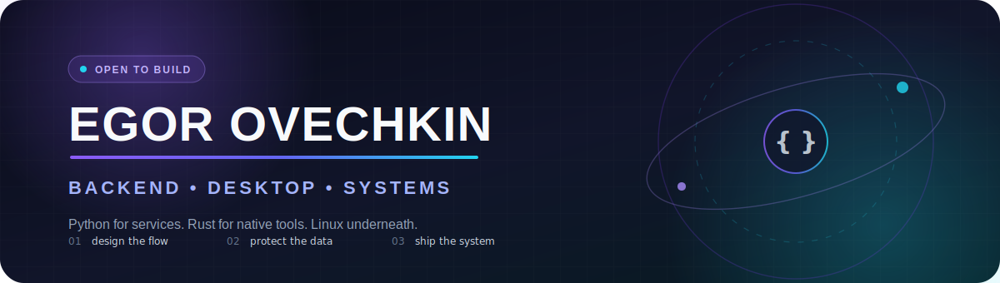

<p align="center">
  
</p>

<p align="center">
  <a href="https://t.me/egor_kodin">
    
  </a>
  <a href="mailto:egor.coden@mail.ru">
    
  </a>
  <a href="https://github.com/egkodin/resume">
    
  </a>
</p>

<p align="center">
  
</p>

<p align="center">
  <a href="#about">Обо мне</a> ·
  <a href="#projects">Проекты</a> ·
  <a href="#stack">Стек</a> ·
  <a href="#journey">Путь</a> ·
  <a href="#contact">Контакты</a>
</p>

---

<a id="about"></a>

## 〔01〕 Обо мне

Я **Егор Овечкин** — разработчик, которому интересен весь путь продукта: от пользовательского сценария и структуры данных до обработки ошибок, тестов, развёртывания и понятной документации.

Мой основной опыт связан с **серверной разработкой на Python**, PostgreSQL и Linux. Сейчас я расширяю его в сторону **Rust** и нативных настольных приложений — без встроенного браузера, облачной зависимости и лишней сложности.

> Я не собираю технологии ради списка. Мне интереснее превращать идею в систему, которой можно пользоваться, которую можно поддерживать и которой можно доверять данные.

```text
ТЕКУЩИЙ ВЕКТОР
├── создаю       → Saturn: серверная логика, данные, функции реального времени
├── исследую     → Taglet: Rust, нативный интерфейс, локальная работа с файлами
├── улучшаю      → архитектура, тестирование, инфраструктура Linux
└── следующий шаг → первая профессиональная роль в IT или стажировка
```

### Что мне особенно интересно

- проектировать понятную серверную логику и API;
- работать с данными, миграциями и PostgreSQL;
- создавать безопасные локальные инструменты на Rust;
- находить ошибки через реальные пользовательские сценарии;
- автоматизировать рутину и упрощать сложные процессы;
- доводить документацию, запуск и эксплуатацию до понятного состояния.

---

<a id="projects"></a>

## 〔02〕 Избранные проекты

### 🪐 [Saturn](https://github.com/egkodin/saturn) — социальная платформа для совместной работы людей и ИИ

Мой главный серверный проект и основная площадка для системной разработки. В Saturn я связываю архитектуру, данные, авторизацию, взаимодействие в реальном времени, инфраструктуру и тестирование в один продукт.

<p>
  
  
  
  
  
  
  
</p>

**Что внутри:** пользователи и профили, авторизация, публикации, комментарии, реакции, уведомления, поиск, чат, WebSocket, панель администратора, миграции Alembic, Docker Compose, nginx и автоматические тесты.

**Почему этот проект важен:** Saturn научил меня смотреть на приложение не как на набор обработчиков запросов, а как на систему с состоянием, правами доступа, пользовательскими ожиданиями, ошибками и жизненным циклом данных.

---

### 🎵 [Taglet](https://github.com/egkodin/taglet) — нативный редактор метаданных MP3 на Rust

Небольшое приложение, ориентированное на локальную и безопасную работу с ID3v2-метаданными. Taglet обрабатывает файлы непосредственно на устройстве, не использует встроенный браузер и создаёт резервную копию до первой записи.

<p>
  
  
  
  
  
</p>

**Что реализовано:** редактирование основных тегов, работа с обложками JPEG и PNG, перетаскивание файлов, открытие из командной строки, светлая и тёмная темы, защита несохранённых изменений и отображение характеристик аудио.

**Почему этот проект важен:** Taglet стал переходом от ранних экспериментов с графическими интерфейсами к нативному приложению с валидацией, обработкой ошибок, безопасным сохранением и вниманием к пользовательским данным.

<p align="center">
  <a href="https://github.com/egkodin/saturn">
    
  </a>
  <a href="https://github.com/egkodin/taglet">
    
  </a>
</p>

### Ещё несколько точек на карте

- 🏫 **[1358.space](https://github.com/egkodin/1358.space)** — первый крупный веб-проект с реальными пользователями, обратной связью, чатом и несколькими итерациями продукта.
- 📝 **[blog_django](https://github.com/egkodin/blog_django)** — приложение на Django с регистрацией, авторизацией, профилями и панелью администратора.
- 🧰 **[Textoom](https://github.com/egkodin/Textoom)** — ранний текстовый редактор на Python и Tkinter.
- 📅 **[pylendar](https://github.com/egkodin/pylendar)** — практика создания графических интерфейсов и работы со стандартной библиотекой Python.
- 🌐 **[ru-split-amneziavpn](https://github.com/egkodin/ru-split-amneziavpn)** — практическая работа с сетевыми маршрутами и инструментами Linux.

---

<a id="stack"></a>

## 〔03〕 Технологический радар

<p align="center">
  
</p>

**Серверная разработка** · Python · FastAPI · Django · REST API · WebSocket  
**Данные** · PostgreSQL · SQL · SQLAlchemy · Alembic  
**Настольные приложения** · Rust · Cargo · eframe/egui · локальная работа с файлами  
**Инфраструктура** · Linux · Docker Compose · nginx · Git  
**Качество** · pytest · cargo test · Clippy · проверка пользовательских сценариев  
**Веб-основа** · HTML · CSS · JavaScript · адаптивная вёрстка

### Мой инженерный компас

- **Сначала сценарий** — сперва понимаю, что пользователь пытается сделать, и только потом строю структуру кода.
- **Данные требуют защиты** — проверка входных данных, миграции, резервные копии и предсказуемые ошибки являются частью продукта.
- **Простые системы должны оставаться простыми** — не добавляю инфраструктуру или абстракции без реальной причины.
- **Документация — часть интерфейса** — хороший README и понятный запуск экономят время не меньше, чем хороший API.

---

<a id="journey"></a>

## 〔04〕 Путь разработчика

### 2020 → 2023 · от сайта к реальным пользователям

Начал с небольших Python-приложений и сайтов, затем создал школьный веб-портал с формой обратной связи, ручной модерацией и онлайн-чатом. После пользовательской обратной связи переработал приватность, убрал чувствительные данные и продолжил развивать продукт.

Проект менял направление, дизайн, хостинг и технологии. Я пробовал Ruby и Go, добавлял функции на основе ИИ, выступал с проектом и получил призовое место. Главным результатом стал не конкретный стек, а понимание: программное обеспечение живёт дольше первого выпуска и меняется вместе с обратной связью.

### 2024 → 2026 · серверная разработка, инфраструктура и нативные приложения

Стал системнее оформлять проекты: Docker, миграции, тесты, документация, понятный запуск и структура репозиториев. Saturn дал практику работы над крупной серверной системой, а Taglet открыл направление Rust и локальной настольной разработки.

Сейчас мой фокус — превращать накопленный самостоятельный опыт в профессиональную инженерную практику внутри команды.

---

## 〔05〕 Активность на GitHub

<p align="center">
  
  
</p>

---

<a id="contact"></a>

## 〔06〕 Давайте создавать полезные системы

Я открыт к первой профессиональной роли в IT, стажировке или технической позиции, где ценятся любознательность, ответственность и готовность разбираться в реальных задачах.

<p align="center">
  <a href="https://t.me/egor_kodin">
    
  </a>
  <a href="mailto:egor.coden@mail.ru">
    
  </a>
</p>

<p align="center">
  <sub>создано с любопытством · улучшено благодаря обратной связи · выпущено из Linux</sub>
</p>
