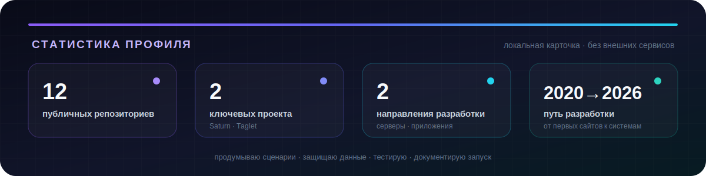

<p align="center">
  
</p>

<p align="center">
  <a href="https://t.me/egor_kodin">
    
  </a>
  <a href="mailto:egor.coden@mail.ru">
    
  </a>
  <a href="https://github.com/egkodin/resume">
    
  </a>
</p>

<p align="center">
  <strong>Создаю надёжные серверные системы · Разрабатываю нативные приложения · Проектирую скиллы для ИИ-агентов</strong>
</p>

| [Обо мне](#обо-мне) | [Проекты](#проекты) | [Стек](#стек-и-технологии) | [Путь](#путь-разработчика) | [Статистика](#статистика) | [Контакты](#контакты) |
|:---:|:---:|:---:|:---:|:---:|:---:|

---

## Обо мне

Я **Егор Овечкин** — разработчик, которому интересен весь путь продукта: от пользовательского сценария и структуры данных до обработки ошибок, тестов, развёртывания и понятной документации.

Мой основной опыт связан с **серверной разработкой на Python**, PostgreSQL и Linux. Параллельно я развиваюсь в **Rust**, нативных настольных приложениях и создании инструментов, которые помогают ИИ-агентам проектировать интерфейсы более осмысленно и предсказуемо.

> Я не собираю технологии ради списка. Мне интереснее превращать идею в систему, которой можно пользоваться, которую можно поддерживать и которой можно доверять данные.

```text
ТЕКУЩИЙ ВЕКТОР
├── развиваю       → Saturn: серверная логика, данные, функции реального времени
├── создаю         → Taglet: Rust, нативный интерфейс, локальная работа с файлами
├── проектирую     → Asterframe: скиллы, дизайн-процессы и проверки для ИИ-агентов
├── улучшаю        → архитектура, тестирование, инфраструктура Linux
└── следующий шаг → первая профессиональная роль в IT или стажировка
```

### Что мне особенно интересно

- проектировать понятную серверную логику и API;
- работать с данными, миграциями и PostgreSQL;
- создавать безопасные локальные инструменты на Rust;
- превращать экспертные процессы в повторяемые скиллы для ИИ-агентов;
- сочетать дизайн-решения с детерминированными проверками качества;
- находить ошибки через реальные пользовательские сценарии;
- доводить документацию, запуск и эксплуатацию до понятного состояния.

---

## Проекты

### 🪐 [Saturn](https://github.com/egkodin/saturn) — социальная платформа для совместной работы людей и ИИ

Мой главный серверный проект и основная площадка для системной разработки. В Saturn я связываю архитектуру, данные, авторизацию, взаимодействие в реальном времени, инфраструктуру и тестирование в один продукт.

<p>
  
  
  
  
  
  
  
</p>

**Что внутри:** пользователи и профили, авторизация, публикации, комментарии, реакции, уведомления, поиск, чат, WebSocket, панель администратора, миграции Alembic, Docker Compose, nginx и автоматические тесты.

**Почему этот проект важен:** Saturn научил меня смотреть на приложение не как на набор обработчиков запросов, а как на систему с состоянием, правами доступа, пользовательскими ожиданиями, ошибками и жизненным циклом данных.

---

### 🎵 [Taglet](https://github.com/egkodin/taglet) — нативный редактор метаданных MP3 на Rust

Небольшое приложение, ориентированное на локальную и безопасную работу с ID3v2-метаданными. Taglet обрабатывает файлы непосредственно на устройстве, не использует встроенный браузер и создаёт резервную копию до первой записи.

<p>
  
  
  
  
  
</p>

**Что реализовано:** редактирование основных тегов, работа с обложками JPEG и PNG, перетаскивание файлов, открытие из командной строки, светлая и тёмная темы, защита несохранённых изменений и отображение характеристик аудио.

**Почему этот проект важен:** Taglet стал переходом от ранних экспериментов с графическими интерфейсами к нативному приложению с валидацией, обработкой ошибок, безопасным сохранением и вниманием к пользовательским данным.

---

### ✦ [Asterframe](https://github.com/egkodin/asterframe) — дизайн-направление для ИИ-агентов разработки

Asterframe — единый скилл, который помогает ИИ-агентам создавать, перерабатывать, проверять и улучшать интерфейсы не через случайный стилевой запрос, а через структурированный дизайн-процесс.

<p>
  
  
  
  
  
</p>

**Что внутри:** один маршрутизируемый скилл, 27 команд, 44 детерминированных правила, локальная база знаний UI/UX, режим итерации в работающем браузере и сценарии для создания, редизайна, аудита, полировки, адаптации и документирования интерфейсов.

**Какую проблему решает:** ИИ-агенты часто сходятся к одинаковым шаблонным интерфейсам. Asterframe помогает учитывать контекст продукта, сохранять поведение и доступность, находить повторяющиеся визуальные ошибки и проверять результат до выпуска.

**Почему этот проект важен:** Asterframe показывает мой переход от разработки отдельных приложений к проектированию инструментов и рабочих процессов для других разработчиков и ИИ-агентов. В нём соединяются маршрутизация, дизайн-системы, автоматические проверки, браузерная итерация и документация.

> Скилл совместим с Codex и другими агентными средами, а также содержит инструкции установки для Claude Code и Cursor.

### Ещё несколько точек на карте

- 🏫 **[1358.space](https://github.com/egkodin/1358.space)** — первый крупный веб-проект с реальными пользователями, обратной связью, чатом и несколькими итерациями продукта.
- 📝 **[blog_django](https://github.com/egkodin/blog_django)** — приложение на Django с регистрацией, авторизацией, профилями и панелью администратора.
- 🧰 **[Textoom](https://github.com/egkodin/Textoom)** — ранний текстовый редактор на Python и Tkinter.
- 📅 **[pylendar](https://github.com/egkodin/pylendar)** — практика создания графических интерфейсов и работы со стандартной библиотекой Python.
- 🌐 **[ru-split-amneziavpn](https://github.com/egkodin/ru-split-amneziavpn)** — практическая работа с сетевыми маршрутами и инструментами Linux.

---

## Стек и технологии

<p align="center">
  
</p>

**Серверная разработка** · Python · FastAPI · Django · REST API · WebSocket  
**Данные** · PostgreSQL · SQL · SQLAlchemy · Alembic  
**Настольные приложения** · Rust · Cargo · eframe/egui · локальная работа с файлами  
**Инструменты для ИИ-агентов** · скиллы · маршрутизация команд · Node.js · Python · браузерная итерация  
**Дизайн и качество интерфейсов** · UI/UX-паттерны · доступность · адаптивность · движение · детерминированные проверки  
**Инфраструктура** · Linux · Docker Compose · nginx · Git  
**Качество кода** · pytest · cargo test · Clippy · Node.js Test Runner · проверка пользовательских сценариев  
**Веб-основа** · HTML · CSS · JavaScript · адаптивная вёрстка

### Мой инженерный компас

- **Сначала контекст** — прежде чем выбирать решение, понимаю продукт, аудиторию, ограничения и существующее поведение.
- **Сначала сценарий** — сперва определяю, что пользователь пытается сделать, и только потом строю структуру кода или интерфейса.
- **Данные требуют защиты** — проверка входных данных, миграции, резервные копии и предсказуемые ошибки являются частью продукта.
- **Автоматизация должна усиливать суждение** — проверки дают факты, но итоговое решение всегда зависит от контекста.
- **Простые системы должны оставаться простыми** — не добавляю инфраструктуру или абстракции без реальной причины.
- **Документация — часть интерфейса** — хороший README и понятный запуск экономят время не меньше, чем хороший API.

---

## Путь разработчика

### 2020 → 2023 · от сайта к реальным пользователям

Начал с небольших Python-приложений и сайтов, затем создал школьный веб-портал с формой обратной связи, ручной модерацией и онлайн-чатом. После пользовательской обратной связи переработал приватность, убрал чувствительные данные и продолжил развивать продукт.

Проект менял направление, дизайн, хостинг и технологии. Я пробовал Ruby и Go, добавлял функции на основе ИИ, выступал с проектом и получил призовое место. Главным результатом стал не конкретный стек, а понимание: программное обеспечение живёт дольше первого выпуска и меняется вместе с обратной связью.

### 2024 → 2026 · серверные системы, нативные приложения и ИИ-агенты

Стал системнее оформлять проекты: Docker, миграции, тесты, документация, понятный запуск и структура репозиториев. Saturn дал практику работы над крупной серверной системой, Taglet открыл направление Rust и локальной настольной разработки, а Asterframe стал первым проектом, где я упаковал знания и правила в самостоятельный скилл для ИИ-агентов.

Сейчас мой фокус — превращать накопленный самостоятельный опыт в профессиональную инженерную практику внутри команды и создавать инструменты, которые делают разработку более осмысленной и воспроизводимой.

---

## Статистика

<p align="center">
  
</p>

Статистика оформлена как локальная SVG-карточка внутри репозитория. Она показывает текущий срез портфолио и не зависит от доступности сторонних сервисов.

---

## Контакты

Я открыт к первой профессиональной роли в IT, стажировке или технической позиции, где ценятся любознательность, ответственность и готовность разбираться в реальных задачах.

<p align="center">
  <a href="https://t.me/egor_kodin">
    
  </a>
  <a href="mailto:egor.coden@mail.ru">
    
  </a>
</p>

<p align="center">
  <sub>понимаю контекст · проектирую сценарии · защищаю данные · проверяю качество</sub>
</p>