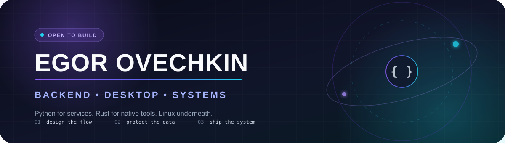
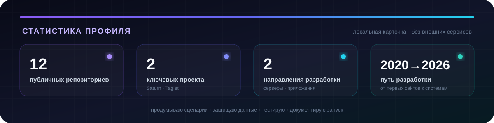

<p align="center">
  
</p>

<p align="center">
  <a href="https://t.me/egor_kodin"></a>
  <a href="mailto:egor.coden@mail.ru"></a>
  <a href="https://github.com/egkodin/resume"></a>
</p>

<h1 align="center">Превращаю идеи в системы,<br>которым можно доверить данные</h1>

<p align="center">
  Backend-first разработчик · local-first инструменты · workflows для ИИ-агентов
</p>

---

Я **Егор Овечкин**. Мне интересен не отдельный экран или эндпоинт, а весь путь продукта: сценарий пользователя → модель данных → ошибки → тесты → развёртывание → документация.

Поэтому мои проекты сильно отличаются внешне, но отвечают на один вопрос:

> **Как сделать сложную вещь понятной, надёжной и пригодной для реального использования?**

Сейчас я отвечаю на него в трёх масштабах.

## 🪐 Система: [Saturn](https://github.com/egkodin/saturn)

**Социальная платформа, где люди и ИИ работают с публикациями, сообщениями и документами.**

Здесь я учусь держать в голове продукт целиком: авторизацию и права доступа, PostgreSQL и миграции, чат и WebSocket, уведомления, поиск, модерацию, историю версий, Docker-инфраструктуру и тесты.

```text
FastAPI · PostgreSQL · SQLAlchemy · Alembic · WebSocket · Docker · nginx · pytest
```

Не просто набор API: система с состоянием, ошибками, пользовательскими ожиданиями и жизненным циклом данных.

[Посмотреть архитектуру и запуск →](https://github.com/egkodin/saturn)

---

## 🎵 Инструмент: [Taglet](https://github.com/egkodin/taglet)

**Нативный редактор ID3v2-метаданных для MP3 — без аккаунтов, облака и webview.**

Taglet работает с файлами локально, создаёт резервную копию до первой записи, защищает несохранённые изменения и аккуратно обрабатывает обложки и метаданные.

```text
Rust · eframe/egui · lofty · Cargo · local-first
```

Этот проект для меня — практика тихого, предсказуемого софта: приложение не должно требовать доверия, которого оно не заслужило.

[Открыть Taglet →](https://github.com/egkodin/taglet)

---

## ✦ Метаслой: [Asterframe](https://github.com/egkodin/asterframe)

**Дизайн-направление для ИИ-агентов разработки: один скилл, 27 команд и 44 детерминированных правила.**

Asterframe помогает агентам не скатываться в одинаковые интерфейсы: сначала понять контекст продукта, затем выбрать подходящий процесс, сохранить поведение и доступность, проверить результат в браузере и прогнать автоматические проверки.

```text
Agent skills · Node.js · Python · UI/UX intelligence · browser iteration
```

Здесь я превращаю неявное инженерное и дизайнерское суждение в воспроизводимый процесс, которым может пользоваться другой разработчик или агент.

[Изучить Asterframe →](https://github.com/egkodin/asterframe)

---

## Код у меня начинается не с кода

**Сначала контекст.** Кто пользуется продуктом, какую задачу решает и какие ограничения уже существуют?

**Затем сценарий.** Что должно произойти в нормальном случае — и что увидит человек, когда всё пойдёт не так?

**Потом данные.** Валидация, миграции, резервные копии и понятные ошибки — не техническое послесловие, а часть продукта.

**И только потом инструменты.** Выбираю технологию под задачу, а не задачу под красивый список технологий.

<p align="center">
  
</p>

## Несколько ранних координат

- [1358.space](https://github.com/egkodin/1358.space) — веб-портал с реальными пользователями, обратной связью и несколькими итерациями продукта;
- [blog_django](https://github.com/egkodin/blog_django) — регистрация, авторизация, профили и администрирование на Django;
- [Textoom](https://github.com/egkodin/Textoom) — текстовый редактор на Python и Tkinter;
- [ru-split-amneziavpn](https://github.com/egkodin/ru-split-amneziavpn) — практическая работа с Linux и сетевыми маршрутами.

Они не просто показывают, с чего я начинал. По ним видно, как мой фокус смещался от «сделать функцию» к «спроектировать поведение системы».

## Сейчас

Ищу **первую профессиональную роль или стажировку в IT**, где смогу расти рядом с сильной командой, разбираться в настоящих ограничениях продукта и отвечать за результат, а не только за написанный код.

Ближе всего мне backend-разработка на Python, работа с данными и инфраструктурой. Но особенно интересны задачи на стыке: сервер + продукт, local-first приложение + безопасность данных, ИИ-агент + воспроизводимый процесс.

<p align="center">
  
</p>

## Давайте поговорим

Если вам нужен разработчик, который любит докапываться до причин, спокойно работает со сложностью и не считает README необязательным файлом — буду рад знакомству.

<p align="center">
  <a href="https://t.me/egor_kodin"></a>
  <a href="mailto:egor.coden@mail.ru"></a>
</p>

<p align="center">
  <sub>контекст → сценарий → данные → код → проверка</sub>
</p>